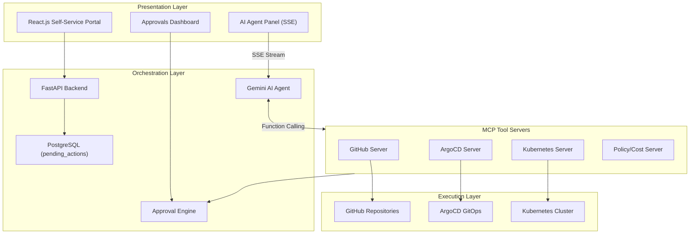

# Academic Internal Developer Platform (IDP)

A self-service Internal Developer Platform tailored for academic environments that automates end-to-end cloud infrastructure provisioning.

## Phase 1.5 Architecture (Agent-Driven)

The platform utilizes an autonomous, agent-driven architecture powered by Gemini 2.0 and the Model Context Protocol (MCP). Instead of static wrappers, a DevSecOps AI Mentor actively manages provisioning and deployment via human-in-the-loop (HITL) approval gates.



## Project Structure

```
├── frontend/           # React + Vite — Self-service portal & Agent UI
├── backend/            # FastAPI — Orchestration & Agent loop
│   ├── app/mcp_servers/ # Model Context Protocol Tool Integrations
├── iac/                # Terraform — Infrastructure as Code
├── k8s/                # Kustomize manifests — ArgoCD target
├── .github/workflows/  # GitHub Actions CI/CD
└── docker-compose.yml  # Local development environment
```

## Quick Start

### Prerequisites
- Python 3.12+
- Node.js 20+
- Docker & Docker Compose
- Terraform 1.9+ (optional, for IaC validation)
- Gemini API Key

### Local Development

```bash
# 1. Clone the repository
git clone <repo-url> && cd <repo-name>

# 2. Add API Keys to .env
# Required: GEMINI_API_KEY
# Optional: GITHUB_TOKEN, KUBECONFIG, ARGOCD_TOKEN

# 3. Start all services with Docker Compose
docker-compose up -d --build

# 4. Access the platform
#    Frontend:            http://localhost:5173
#    Backend (API Docs):  http://localhost:8000/docs
```

## API Endpoints

| Method | Endpoint | Description |
|--------|----------|-------------|
| POST | `/api/v1/agent/run` | Stream agent reasoning & tool calls (SSE) |
| GET | `/api/v1/approvals/pending` | List HITL pending mutating actions |
| POST | `/api/v1/approvals/{id}/approve` | Approve and execute a pending AI action |
| POST | `/api/v1/approvals/{id}/reject` | Reject a pending AI action |
| POST | `/api/v1/projects/create` | Create a new project from form data |
| GET | `/api/v1/projects/{id}/status` | Get project deployment status |
| GET | `/api/v1/health` | Health check |

## Tech Stack

| Layer | Technology |
|-------|------------|
| Frontend | React.js + Vite |
| Backend | FastAPI (Python 3.12) |
| Database | PostgreSQL + SQLAlchemy (async) |
| Agent | Google Gemini API (2.0 Flash) + MCP |
| IaC | Terraform |
| CI/CD | GitHub Actions |
| GitOps | ArgoCD |
| Orchestration | Kubernetes |
| Monitoring | Prometheus + Grafana |

## License

MIT
