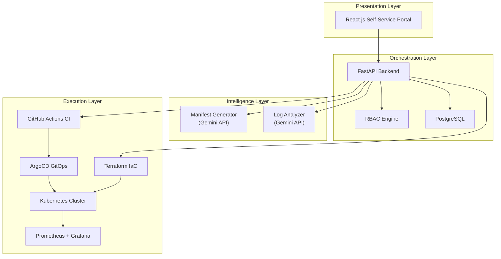

# 🎓 Academic Internal Developer Platform (IDP)

A self-service Internal Developer Platform tailored for academic environments that automates end-to-end cloud infrastructure provisioning.

## Architecture



## Project Structure

```
├── frontend/          # React + Vite — Self-service portal
├── backend/           # FastAPI — Orchestration layer
├── iac/               # Terraform — Infrastructure as Code
├── k8s/               # Kustomize manifests — ArgoCD target
├── .github/workflows/ # GitHub Actions CI/CD
└── docker-compose.yml # Local development environment
```

## Quick Start

### Prerequisites
- Python 3.12+
- Node.js 20+
- Docker & Docker Compose
- Terraform 1.9+ (optional, for IaC validation)

### Local Development

```bash
# 1. Clone the repository
git clone <repo-url> && cd <repo-name>

# 2. Start all services with Docker Compose
docker-compose up -d

# 3. Access the platform
#    Frontend:  http://localhost:5173
#    Backend:   http://localhost:8000
#    API Docs:  http://localhost:8000/docs
```

### Manual Setup

```bash
# Backend
cd backend
python -m venv .venv
.venv\Scripts\activate        # Windows
pip install -r requirements.txt
cp .env.example .env
uvicorn app.main:app --reload --port 8000

# Frontend
cd frontend
npm install
npm run dev
```

## API Endpoints

| Method | Endpoint | Description |
|--------|----------|-------------|
| POST | `/api/v1/projects/create` | Create a new project from form data |
| GET | `/api/v1/projects/{id}/status` | Get project deployment status |
| POST | `/api/v1/ai/manifest-generate` | Generate K8s manifests via Gemini |
| POST | `/api/v1/ai/log-analyze` | Analyze error logs via Gemini |
| GET | `/api/v1/health` | Health check |

## Tech Stack

| Layer | Technology |
|-------|------------|
| Frontend | React.js + Vite |
| Backend | FastAPI (Python 3.12) |
| Database | PostgreSQL + SQLAlchemy (async) |
| Auth | JWT (stub for Phase 1) |
| IaC | Terraform |
| CI/CD | GitHub Actions |
| GitOps | ArgoCD |
| Orchestration | Kubernetes |
| AI | Google Gemini API |
| Monitoring | Prometheus + Grafana |

## License

MIT
